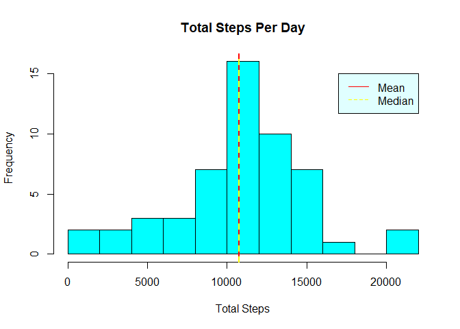
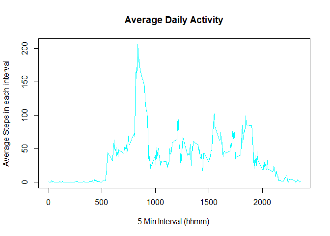
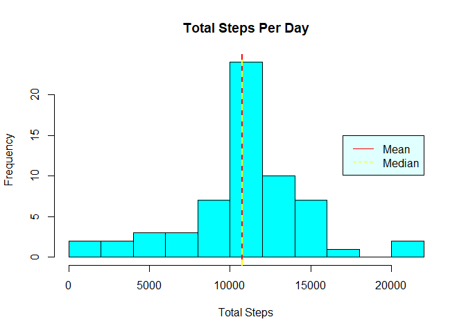
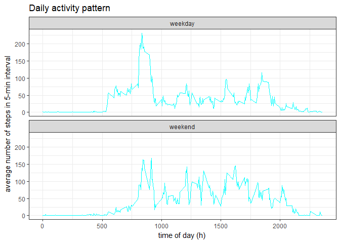

## Loading and preprocessing the data


```r
unzip("activity.zip")
file<-"activity.csv"
stepData<-read.csv(file )
str(stepData)
```

```
## 'data.frame':	17568 obs. of  3 variables:
##  $ steps   : int  NA NA NA NA NA NA NA NA NA NA ...
##  $ date    : Factor w/ 61 levels "2012-10-01","2012-10-02",..: 1 1 1 1 1 1 1 1 1 1 ...
##  $ interval: int  0 5 10 15 20 25 30 35 40 45 ...
```

#### Convert Date date from factor to Date object


```r
stepData$date<- as.Date(as.character(stepData$date),"%Y-%m-%d")
```

## What is mean total number of steps taken per day?

####Calculate the Sum for every set grouped by Date

```r
totalSteps<-tapply(stepData$steps,stepData$date,sum)
```

#### As evident from the below Histogram for total Steps per day, Mean and median are almost same

```r
hist(totalSteps,col="cyan",xlab = "Total Steps", main = "Total Steps Per Day",breaks = 8 )
abline(v=mean(totalSteps,na.rm = T),col="red",lwd=2)
abline(v=median(totalSteps,na.rm = T),col="yellow",lwd=2,lty=2)
legend(17000,15,legend=c("Mean","Median"),border = "black", lty = c(1,2),col = c("red","yellow"),bg = "light cyan")
```

<!-- -->


```r
meanSteps<-mean(totalSteps,na.rm = T)
medianSteps<-median(totalSteps,na.rm = T)
```
Mean total number of steps is 1.0766189\times 10^{4}.

## What is the average daily activity pattern?

####Calculate the Mean for every set grouped by Interval

```r
dfMean<-aggregate(stepData$steps,list(stepData$interval),function(x) mean(x, na.rm=TRUE))
```


####Below Histogram shows Average daily activity throughout the day

```r
plot(dfMean,type="l",main="Average Daily Activity",
     xlab="5 Min Interval (hhmm) ",ylab="Average Steps in each interval",col="cyan")
```

<!-- -->


```r
max_steps<-max(dfMean$Steps)
max_step_post<-which(dfMean$Steps==max_steps)
max_step_interval<-dfMean$interval[max_step_post]
```
The maximum number of steps 206.1698113 was taken at 835


## Imputing missing values

#### Total no. of NAs in Steps Data

```r
rows_na<-is.na(stepData$steps)
sum(rows_na)
```

```
## [1] 2304
```

####strategy to fill missing data - Fill missing values with the mean of steps in the specific interval


```r
getMean <- function(interval){
   mean<-(dfMean[dfMean$interval == interval, "Steps"])
   return(mean)
}

filled.stepData<-stepData
for (x in 1:nrow(stepData)) {
   if(is.na(stepData[x,"steps"])){
      filled.stepData[x,"steps"]<-getMean(stepData[x,"interval"])
   }
}
```
####Summary of Original Data and Imputed Data

```r
summary(filled.stepData)
```

```
##      steps             date               interval     
##  Min.   :  0.00   Min.   :2012-10-01   Min.   :   0.0  
##  1st Qu.:  0.00   1st Qu.:2012-10-16   1st Qu.: 588.8  
##  Median :  0.00   Median :2012-10-31   Median :1177.5  
##  Mean   : 37.38   Mean   :2012-10-31   Mean   :1177.5  
##  3rd Qu.: 27.00   3rd Qu.:2012-11-15   3rd Qu.:1766.2  
##  Max.   :806.00   Max.   :2012-11-30   Max.   :2355.0
```

```r
summary(stepData)
```

```
##      steps             date               interval     
##  Min.   :  0.00   Min.   :2012-10-01   Min.   :   0.0  
##  1st Qu.:  0.00   1st Qu.:2012-10-16   1st Qu.: 588.8  
##  Median :  0.00   Median :2012-10-31   Median :1177.5  
##  Mean   : 37.38   Mean   :2012-10-31   Mean   :1177.5  
##  3rd Qu.: 12.00   3rd Qu.:2012-11-15   3rd Qu.:1766.2  
##  Max.   :806.00   Max.   :2012-11-30   Max.   :2355.0  
##  NA's   :2304
```
###Histogram for filled data without NAs

####Calculate the Sum for every set grouped by Date for Imputed Data

```r
filled.totalSteps<-tapply(filled.stepData$steps,filled.stepData$date,sum)
```

#### As evident from the below Histogram for total Steps per day, Mean and median are almost same

```r
hist(filled.totalSteps,col="cyan",xlab = "Total Steps", main = "Total Steps Per Day",breaks = 8 )
abline(v=mean(filled.totalSteps,na.rm = T),col="red",lwd=2)
abline(v=median(filled.totalSteps,na.rm = T),col="yellow",lwd=2,lty=2)
legend(17000,15,legend=c("Mean","Median"),border = "black", lty = c(1,2),col = c("red","yellow"),bg = "light cyan")
```

<!-- -->


```r
meanStepsImp<-mean(filled.totalSteps,na.rm = T)
medianStepsImp<-median(filled.totalSteps,na.rm = T)
```
Mean total number of steps for Imputed Data is 1.0766189\times 10^{4}. Mean didnt Change however median is changed from 10765 to 1.0766189\times 10^{4}


## Are there differences in activity patterns between weekdays and weekends?

```r
week <- factor(weekdays(filled.stepData$date) %in% c("Saturday","Sunday"), 
               labels=c("weekday","weekend"), ordered=FALSE)

impsteps <- aggregate(filled.stepData$steps, 
                      by=list(interval=filled.stepData$interval, weekday=week), 
                      mean)
```

### Below is the Activity pattern bewteen Weekday and weekend

```r
g <- ggplot(impsteps, aes(interval, x))
g + geom_line(col="cyan") + facet_wrap( ~ weekday,ncol = 1)  +
   theme_bw() +
   labs(y="average number of steps in 5-min interval") +
   labs(x="time of day (h)") +
   labs(title="Daily activity pattern")
```

<!-- -->
